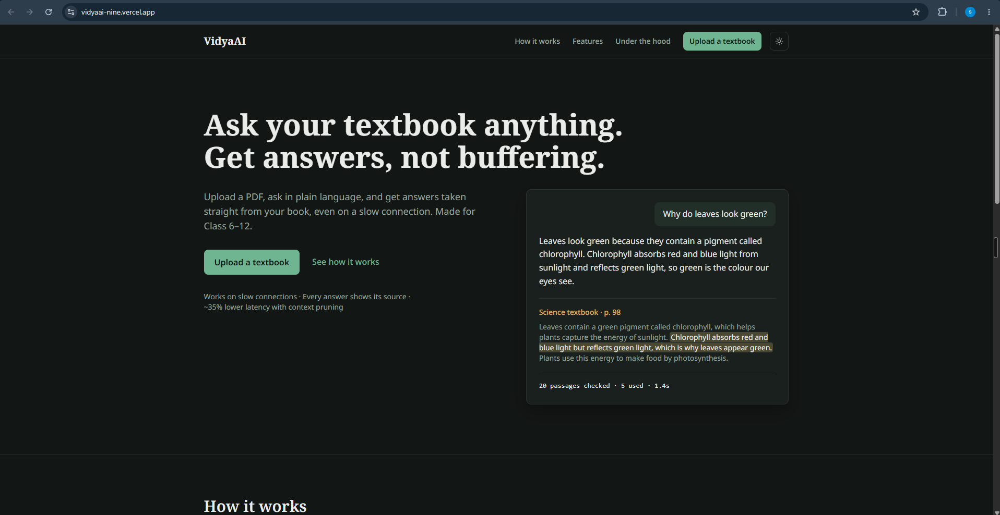
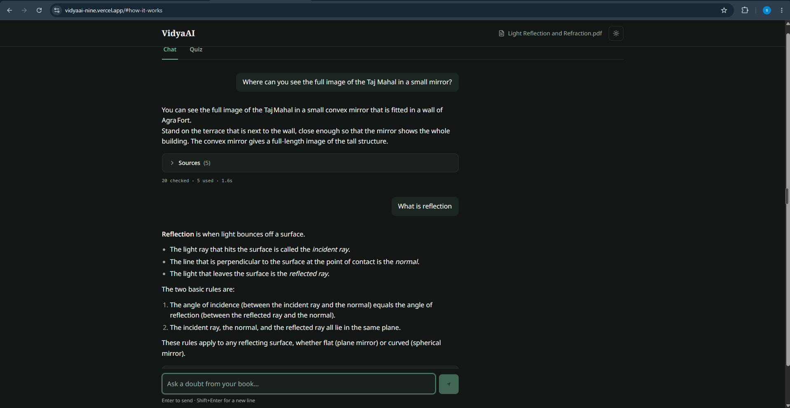
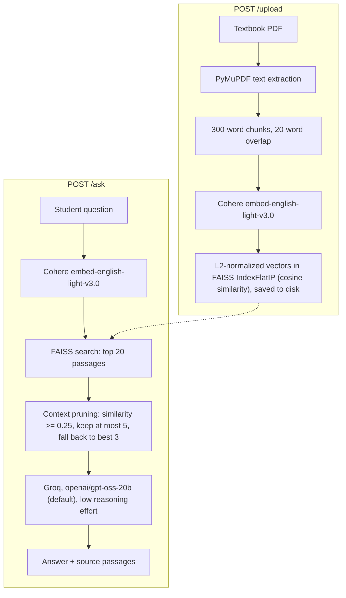
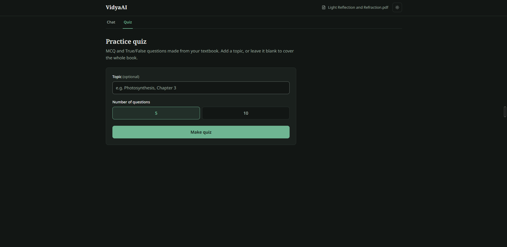
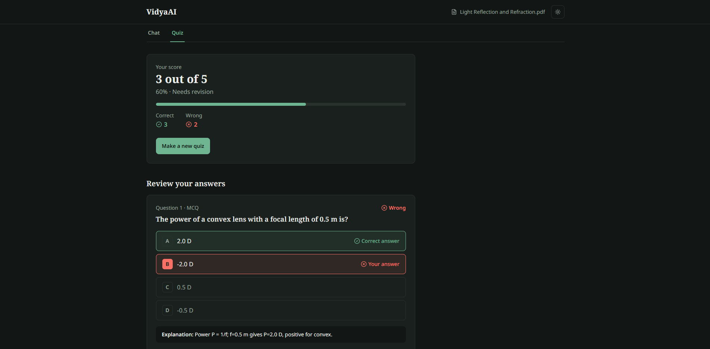

# VidyaAI

**Ask your textbook anything. Get answers, not buffering.**

VidyaAI is a study tool for school students. A student uploads a textbook PDF, asks questions about it, and gets answers drawn only from that book, along with the passages each answer came from. It can also turn the same book into practice quizzes.

Live demo: https://vidyaai-nine.vercel.app



## The problem

Students in Classes 6 to 12 in India often study from a single textbook, on slow internet and inexpensive phones, with little help available when they get stuck. General-purpose chatbots answer from general knowledge rather than from the book the student is actually studying. VidyaAI keeps every answer tied to the student's own textbook and keeps each request small.

## What it does

- **Answers from the uploaded book.** Each answer is generated only from passages retrieved from the uploaded PDF. The passages used are shown next to the answer, and sentences that share key words with the question are highlighted so the student can check the answer against the book.
- **Practice quizzes.** Generates multiple-choice and True/False questions from the book, 5 or 10 at a time, with an optional topic to focus on. Each question comes with a short explanation of the correct answer.
- **Built for slow connections.** Only a few relevant passages are sent to the language model for each question, the frontend bundle is small, fonts are self-hosted, and the app tells the student when the server is waking up instead of leaving them waiting silently.



## How it works



1. **Upload.** The PDF's text is extracted with PyMuPDF, flattened into one stream of words, and split into 300-word passages with a 20-word overlap. Each passage is embedded with Cohere's `embed-english-light-v3.0` model. The vectors are L2-normalized and stored in a FAISS `IndexFlatIP` index, so inner product equals cosine similarity. The index and passages are written to `backend/faiss_store/`.
2. **Ask.** The question is embedded with the same Cohere model, and FAISS returns the 20 most similar passages. These are pruned (see below) and the remaining passages are sent to Groq along with a system prompt that tells the model to use only the given context, to say so when the answer is not there, and to write formulas as plain text. The model defaults to `openai/gpt-oss-20b` and can be changed with the `GROQ_MODEL` environment variable. The response contains the answer, the passages used with their similarity scores, and how many passages were checked and kept.

### Context pruning

`backend/pruner.py` decides which of the 20 retrieved passages reach the model:

1. Drop every passage whose cosine similarity to the question is below the threshold (0.25 by default).
2. If no passage passes, keep the 3 most similar passages instead, so the model always has some context.
3. Sort what is left by similarity and keep at most 5.

Passages are ranked by similarity score only. A reranking model would likely pick better passages, but it was left out to keep the project within free-tier API limits.

### Quiz generation

`POST /quiz` builds a quiz in these steps:

1. **Pick passages.** If the student gives a topic, the topic is embedded and the 8 most similar passages are used. With no topic, 8 passages are picked at random from the whole book.
2. **Generate.** The passages go to Groq with a prompt asking for the requested number of questions, mixing MCQ and True/False, using only facts from the passages, and never giving the answer away in the question. The request uses Groq's JSON mode (`response_format={"type": "json_object"}`), so the reply is a JSON object. Any markdown code fences are stripped as a fallback.
3. **Validate.** Each question is checked against a Pydantic model (`type`, `question`, `options`, `correct`, `explanation`). Malformed questions are skipped, and any question whose `correct` value is not exactly one of its `options` is discarded. If no valid questions remain, the API returns an error asking the student to try again.

The backend accepts 1 to 10 questions per quiz. The interface offers 5 or 10.

## Results

| Measure | Result |
| --- | --- |
| Latency with context pruning | About 35% lower than sending all 20 passages |
| Text sent to the model per question | About 1,500 words instead of about 6,000 (about 75% less) |
| Typical answer time | About 1.4 s once the server is awake |
| Example: NCERT Class 10, "Light – Reflection and Refraction", question "What is 1 dioptre?" | 20 passages checked, 1 sent to the model |
| Frontend JavaScript bundle after the redesign | 370 KB to 221 KB (about 40% smaller), 73 KB compressed |
| Accessibility | All text meets WCAG AA contrast in light and dark themes, with visible keyboard focus |




## Tech stack

**Backend**
- Python 3.12 (on Render), FastAPI, Uvicorn
- PyMuPDF for PDF text extraction
- Cohere `embed-english-light-v3.0` for embeddings
- FAISS (`faiss-cpu`) for vector search, NumPy
- Groq API for the language model (`openai/gpt-oss-20b` by default)
- python-dotenv, python-multipart, httpx

**Frontend**
- React 18 and Vite 5
- Tailwind CSS v4 (via `@tailwindcss/vite`)
- axios for API calls, lucide-react for icons
- Noto Sans and Noto Serif, self-hosted through `@fontsource`
- Light and dark themes, following the system setting with a manual toggle

**Hosting**
- Frontend on Vercel
- Backend on Render

## Running locally

### Backend

Requires Python 3.10 to 3.12, plus a Groq API key and a Cohere API key. The pinned versions of NumPy and PyMuPDF do not ship wheels for Python 3.13 or newer.

```bash
cd backend
python -m venv venv
```

Activate the virtual environment:

```bash
# Windows
venv\Scripts\activate

# macOS / Linux
source venv/bin/activate
```

Install dependencies:

```bash
pip install -r requirements.txt
```

Create `backend/.env`:

```env
GROQ_API_KEY=your_groq_api_key
COHERE_API_KEY=your_cohere_api_key

# Optional. Defaults to openai/gpt-oss-20b.
GROQ_MODEL=openai/gpt-oss-20b
```

Start the server from the `backend/` folder (the index is stored in `faiss_store/` relative to the current directory):

```bash
uvicorn main:app --reload
```

The API runs at http://127.0.0.1:8000, and interactive API docs are at http://127.0.0.1:8000/docs.

### Frontend

```bash
cd frontend
npm install
npm run dev
```

The app runs at http://localhost:5173.

By default the frontend calls the deployed backend. To use your local backend, change `API_BASE` in `frontend/src/lib/constants.js`:

```js
export const API_BASE = "http://127.0.0.1:8000";
```

## Limitations and next steps

- **One shared index.** There is a single FAISS index for all users, so each new upload replaces the previous book for everyone. Per-user or per-document indexes are the next step.
- **Uploads do not survive restarts.** The index is stored on Render's temporary disk and is lost when the server restarts or redeploys; the student then has to upload the book again. After a restart, the first request can take up to a minute.
- **PDF extraction is imperfect.** Formulas, tables and page headers often come out garbled. Page numbers are not kept, so sources cannot point to a page. Scanned PDFs without a text layer are rejected, since there is no OCR.
- **Broad questions are weak.** Questions like "summarize this chapter" do not match any single passage well, so the model often sees only the 3 best passages and gives a partial answer.
- **Pruning uses only the similarity score.** A hosted reranker would help choose better passages.
- **The model does not always follow the prompt.** It can occasionally add outside knowledge or write formulas in LaTeX despite being told not to.
- **No streaming.** The answer appears only once it is complete.
- **English-only embeddings.** `embed-english-light-v3.0` is an English model, so retrieval from Hindi or other regional-language textbooks is likely to be poor.
- **No conversation memory.** Each question is sent on its own, so follow-ups like "explain that more simply" do not know what was asked before.
- **Quizzes can come back short.** Questions that fail validation are dropped rather than regenerated, so a quiz may have fewer questions than requested.
- **Keep-alive URL is hardcoded.** The server pings the deployed Render URL every 10 minutes to stay awake, including when run locally.
- **No authentication or upload size limit**, CORS accepts any origin, and there is no automated test suite.

## License

MIT. See [LICENSE](LICENSE).

Built by [Sourabh Saxena](https://github.com/sourabh-550).
